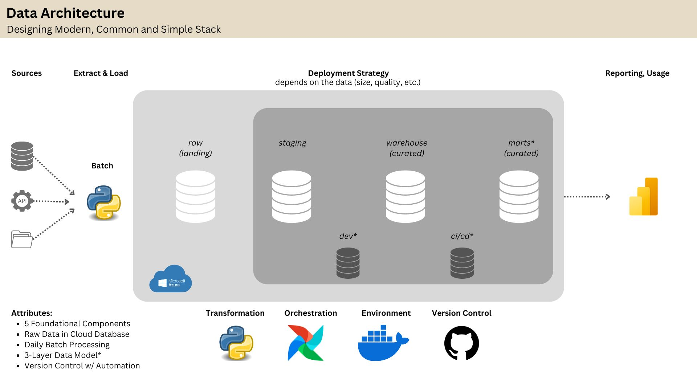
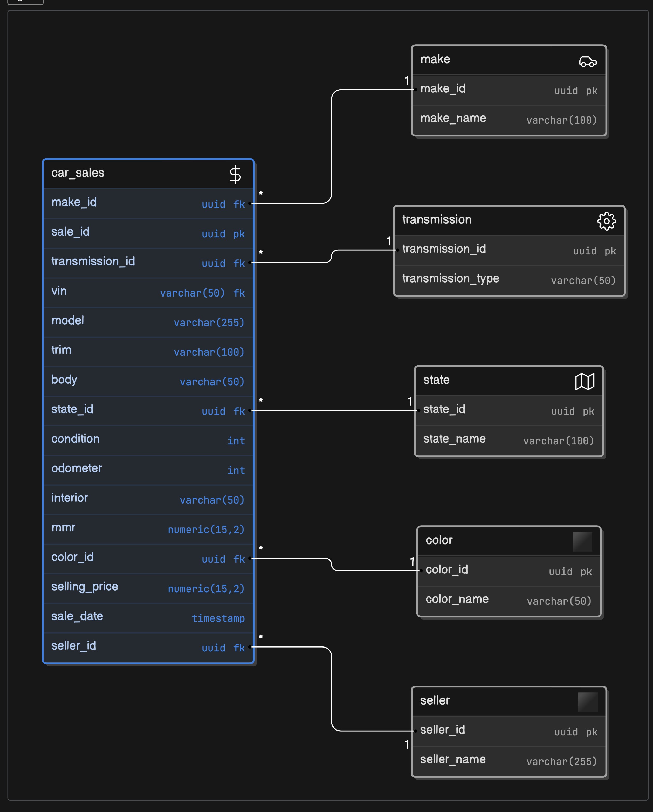
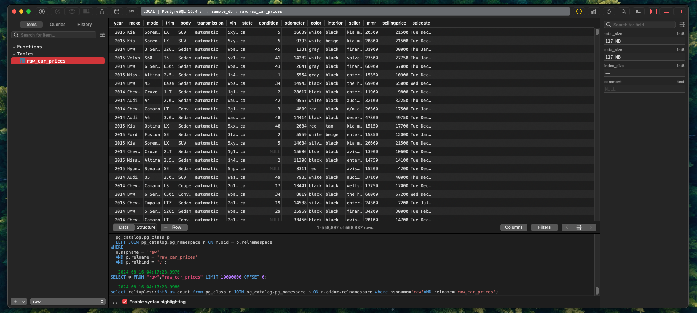
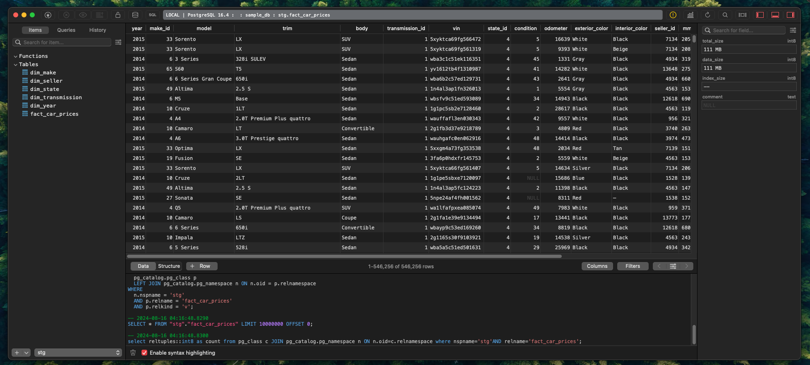
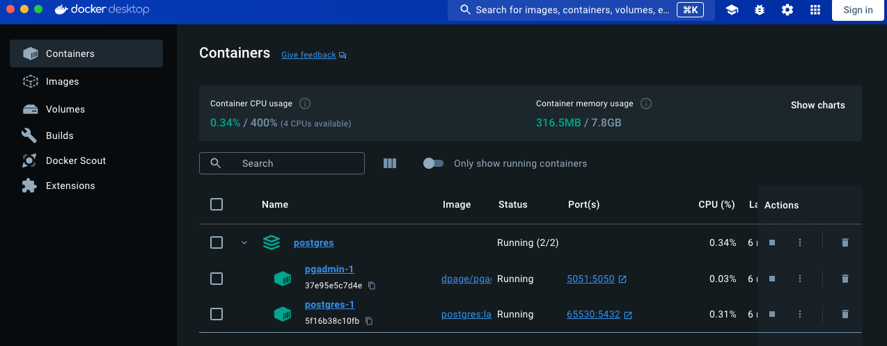
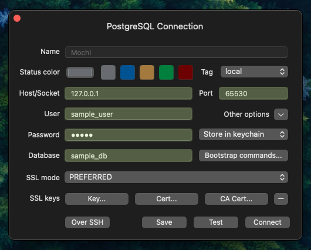

# DE-Assessment

This is the solution set for technical exam. All outputs are within ".images" folder. The project implements the following:
- Transformation from raw schema to staging schema
- Transformation using python.

### Data Architecture
Here is the data architecture guide to the Medallion Architecture, plus the technical stack. I almost always use this deployment strategy and data architecture in building the foundation of the data pipeline.


### Data Processes
There are 4 python data processes implemented. 

- 00_setup_db.py - Setup the database for the reference architecture. 
- 01_ingest.py - Ingest the data to the database.
- 02_transform.py - Transform the data from raw schema database, to staging schema database. This involve denormalization techniques, cleaning the data, processing the data, etc.

### Tech Stack
- Python
- Pandas
- Docker / Container
- PostgreSQL
- Virtual Environment

### Roadmap
- Improve database service and infrastructure. 
- Improve the security. (Azure Key Vault, AWS Secret Manager, HashiCorp Vault)
- Improve the observability and monitoring. (Airflow, Mage)
- Improve the performance. Consider other python libraries.
- Develop the data quality checks.
- Develop the CI/CD infrastructure.

## Getting Started / Implementation

### Prerequisite

Before running the python streamlit application, you should have the following installed in your local machine. 

1. Install the Python 3.11. Also, install the latest version of the docker. We will be using docker-compose to run the postgresql database.
2. Install the poetry library. The library will handle all your python dependencies and virtual environment in your local machine.
    ``` bash
    pip install poetry
    ```
3. Install the project dependencies by installing. Poetry will handle all your python dependencies and virtual environment in your local machine.
    ``` bash
    poetry install
    ```
4. Setup the database.
    ``` bash
    make run_db
    ```

### Running the Data Pipeline

For now, we will be using the command line with poetry to run the data-pipeline or the data processes.

- To run the entire pipeline
    ``` bash
    make run_pipeline
    ```
- To run the a certain process. Running 00_setup_db.py
    ``` bash
    make test_py_setup
    ```
- To run the a certain process. Running 01_ingest.py
    ``` bash
    make test_py_ingest
    ```
- To run the a certain process. Running 02_transform.py
    ``` bash
    make test_py_transform
    ```

## Other Outputs

### Data Modeling


### DB Raw Schema


### DB Staging Schema


### Others (Docker, Connection Details)

